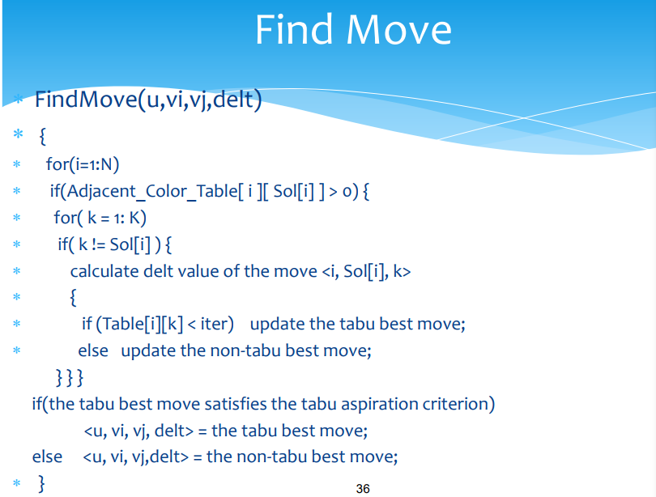
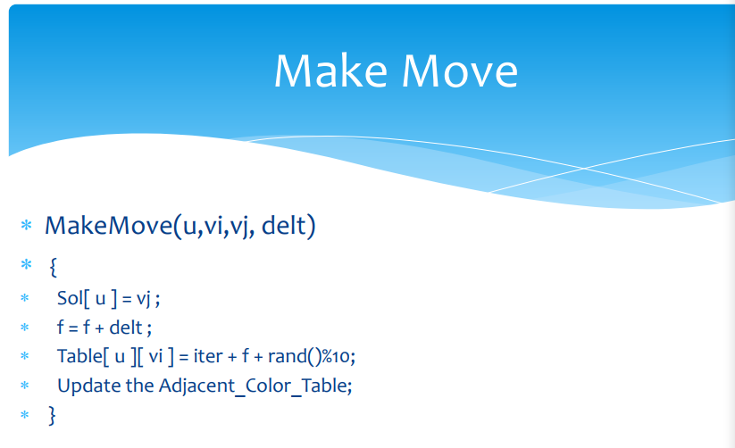

# 解决K-coloring问题——TS、HEA、HEAD

## 引言

对于优化问题有以下分类:


禁忌搜索（TS）由局部搜索发展而来，局部搜索由爬山法发展而来。在了解禁忌搜索之前先熟悉这两种算法。

## 一、 什么是禁忌搜索算法（TS）

### **爬山算法**

爬山算法从当前的节点开始，和周围的邻居节点的值进行比较。 如果当前节点是最大的，那么返回当前节点，作为最大值 \(既山峰最高点\)；反之就用最高的邻居节点来，替换当前节点，从而实现向山峰的高处攀爬的目的。如此循环直到达到最高点。  
因为不是全面搜索，所以结果可能不是最佳。兔子可能只找到了泰山，就不再进行搜索了。

### **局部搜索算法**

局部搜索算法是从爬山法改进而来的。局部搜索算法的基本思想：在搜索过程中，始终选择当前点的邻居中与离目标最近者的方向搜索。同样，局部搜索得到的解不一定是最优解。

### **禁忌搜索算法**

为了找到“全局最优解”，就不应该执着于某一个特定的区域。于是人们对局部搜索进行了改进，得出了禁忌搜索算法。

禁忌（Tabu Search）算法是一种亚启发式\(meta-heuristic\)随机搜索算法，它从一个初始可行解出发，选择一系列的特定搜索方向（移动）作为试探，选择实现让特定的目标函数值变化最多的移动。为了避免陷入局部最优解，TS搜索中采用了一种灵活的“记忆”技术，对已经进行的优化过程进行记录和选择，指导下一步的搜索方向，这就是Tabu表的建立。

### **一群兔子**

1\) 爬山算法  
兔子朝着比现在高的地方跳去。他们找到了不远处的最高山峰。但是这座山不一定是珠穆朗玛峰。这就是爬山法，它不能保证局部最优值就是全局最优值。

2\) 禁忌搜索算法  
兔子们知道一个兔的力量是渺小的。他们互相转告着，哪里的山已经找过，并且找过的每一座山他们都留下一只兔子做记号。他们制定了下一步去哪里寻找的策略。这就是禁忌搜索。

## 二、禁忌搜索思想和过程

### 基本思想

标记已经解得的局部最优解或求解过程，并在进一步的迭代中避开这些局部最优解或求解过程。局部搜索的缺点在于，太过于对某一局部区域以及其邻域的搜索，导致一叶障目。为了找到全局最优解，禁忌搜索就是对于找到的一部分局部最优解，有意识地避开它，从而或得更多的搜索区域。当搜索足够大的周围区域后，再将这部分局部最优解进行比较，产生新的局部最优解也即需要规避的部分。

比喻：兔子们找到了泰山，它们之中的一只就会留守在这里，其他的再去别的地方寻找。就这样，一大圈后，把找到的几个山峰一比较，珠穆朗玛峰脱颖而出。

### 算法流程

总体思路描述：


### 重要概念

1\) 邻域  
官方一点：所谓邻域，简单的说即是给定点附近其他点的集合。在距离空间中，邻域一般被定义为以给定点为圆心的一个圆；而在组合优化问题中，邻域一般定义为由给定转化规则对给定的问题域上每结点进行转化所得到的问题域上结点的集合。  
通俗一点：邻域就是指对当前解进行一个操作\(这个操作可以称之为邻域动作\)可以得到的所有解的集合。那么邻域的本质区别就在于邻域动作的不同了。

2\) 邻域动作  
邻域动作是一个函数，通过这个函数，对当前解s，产生其相应的邻居解集合。例如：对于一个bool型问题，其当前解为：s = 1001，当将邻域动作定义为翻转其中一个bit时，得到的邻居解的集合N\(s\)={0001,1101,1011,1000}，其中N\(s\) ∈ S。同理，当将邻域动作定义为互换相邻bit时，得到的邻居解的集合N\(s\)={0101,1001,1010}。

3\) 禁忌表  
包括禁忌对象和禁忌长度。（当兔子们再寻找的时候，一般地会有意识地避开泰山，因为他们知道，这里已经找过，并且有一只兔子在那里看着了。这就是禁忌搜索中“禁忌表（tabu list）”的含义。）

4\) 侯选集合  
侯选集合由邻域中的邻居组成。常规的方法是从邻域中选择若干个目标值或评价值最佳的邻居入选。

5\) 禁忌对象  
禁忌算法中，由于我们要避免一些操作的重复进行，就要将一些元素放到禁忌表中以禁止对这些元素进行操作，这些元素就是我们指的禁忌对象。（当兔子们再寻找的时候，一般地会有意识地避开泰山，因为这里找过了。并且还有一只兔子在这留守。）

6\) 禁忌长度  
禁忌长度是被禁对象不允许选取的迭代次数。一般是给被禁对象x一个数（禁忌长度） t ，要求对象x 在t 步迭代内被禁，在禁忌表中采用tabu\(x\)=t记忆，每迭代一步，该项指标做运算tabu\(x\)=t−1，直到tabu\(x\)=0时解禁。于是，我们可将所有元素分成两类，被禁元素和自由元素。禁忌长度t 的选取可以有多种方法，例如t=常数，或t=\[√n\]，其中n为邻域中邻居的个数；这种规则容易在算法中实现。  
（那只留在泰山的兔子一般不会就安家在那里了，它会在一定时间后重新回到找最高峰的大军，因为这个时候已经有了许多新的消息，泰山毕竟也有一个不错的高度，需要重新考虑，这个归队时间，在禁忌搜索里面叫做“禁忌长度（tabu length）”。）

7\) 评价函数  
评价函数是侯选集合元素选取的一个评价公式，侯选集合的元素通过评价函数值来选取。以目标函数作为评价函数是比较容易理解的。目标值是一个非常直观的指标，但有时为了方便或易于计算，会采用其他函数来取代目标函数。

8\) 特赦规则  
在禁忌搜索算法的迭代过程中，会出现侯选集中的全部对象都被禁忌，或有一对象被禁，但若解禁则其目标值将有非常大的下降情况。在这样的情况下，为了达到全局最优，我们会让一些禁忌对象重新可选。这种方法称为特赦，相应的规则称为特赦规则。  
（如果在搜索的过程中，留守泰山的兔子还没有归队，但是找到的地方全是华北平原等比较低的地方，兔子们就不得不再次考虑选中泰山，也就是说，当一个有兔子留守的地方优越性太突出，超过了“best so far”的状态，就可以不顾及有没有兔子留守，都把这个地方考虑进来，这就叫“特赦准则（aspiration criterion）”。）

### 具体实现

所要处理的是图着色问题，在步骤2中需要建立邻接表、邻接色矩阵，邻接节点数数组等内容。怎么判断当前状态的优劣呢？需要定义一个判断标准，在图着色问题中，将此标准定义为冲突节点对的总个数。

那么计算最优delt值，也就是计算当前状态的所有邻居状态，在图着色问题中即所有变色方案中，能够带来的最大冲突节点减少量。

在该算法中，禁忌表即某个节点如果变换为某种颜色后可获得当前循环最优delt，那么在本次更新图后，该节点该种颜色将在 $$iter+f+ rand(10)$$次循环内被禁忌。






以下是TS\_Coloring具体算法：

```text
/*
 * @Author: ZJY
 * @Date: 2020-12-10 21:01:56
 * @LastEditTime: 2020-12-11 09:48:39
 * @LastEditors: Please set LastEditors
 * @Description: 48 colors bad work, 49 colors OK
 * @FilePath: \undefinedc:\Users\50465\Desktop\SmartLAB\TS_Coloring.cpp
 */
#include<iostream>
#include<ctime>
#include<fstream>
#include<string>
#include<cstdlib>

using namespace std;

//------------------------变量-----------------------
int Ver_num;//顶点数
int Col_num;//要求颜色数
int method_num = 0;//最优的解决方法数
int BURDEN = INT16_MAX;
int LEA_BURDEN = INT16_MAX;  //冲突总数目，即终止条件
int *Ver_Col;//顶点颜色集
int **AdjVer_Col_num;//邻接节点颜色个数集
int **tabu_tenure;//节点禁忌长度
int **NB_id;//节点的邻接节点ID集
int *Adj_num;//节点的邻接节点个数
bool **Adj_bool;//逻辑邻接表
int **ChgCol_Methods;//可能的变色路径,[i][0]顶点i原色，[i][1]顶点i新色

/**
 * @description: 
 * @param {*}
 * @return {*}
 */
void Initiate(string ex_path){
    ifstream file;
    file.open(ex_path);
    string content;
    //----------------------------------数据读取-------------------------
    while(file.eof()){//若文件未结束
        file >> content;
        if(content == "edge"){
            file >> Ver_num;
            //初始化邻接矩阵
            Adj_bool = new bool *[Ver_num];
            for (int i = 0; i < Ver_num;i++){
                Adj_bool[i] = new bool[Ver_num];
                for (int j = 0; j < Ver_num;j++)
                    Adj_bool[i][j] = false;
            }
        }
        //建立邻接矩阵
        if(content == "e"){
            int v1, v2;
            file >> v1 >> v2;
            Adj_bool[v1 - 1][v2 - 1] = true;
            Adj_bool[v2 - 1][v1 - 1] = true;
        }
    }
    file.close();

    //--------------------初始化节点的邻接节点ID集，节点的邻接节点个数-----------------
    NB_id = new int*[Ver_num];
    Adj_num = new int[Ver_num];
    for (int i = 0; i < Ver_num;i++){
        Adj_num[i] = 0;
        for (int j = 0; j < Ver_num;j++){
            if(Adj_bool[i][j]){
                NB_id[i][Adj_num[i]] = j;
                Adj_num[i]++;
            }
        }
    }

    //-------------------------------余数法随机着色---------------------------------
    srand(time(NULL));
    Ver_Col = new int[Ver_num];
    for (int i = 0; i < Ver_num;i++){
        int k = rand();
        Ver_Col[i] = k % Col_num;
    }
    
    //---------------------------初始化邻接节点颜色个数集--------------------------
    AdjVer_Col_num = new int *[Ver_num];
    BURDEN = 0;
    for (int i = 0; i < Ver_num;i++){
        AdjVer_Col_num[i] = new int[Col_num];
        for (int j = 0; j < Col_num; j++)
            AdjVer_Col_num[i][j] = 0;
        for (int j = 0; j < Ver_num; j++)
        { 
             //如果两个顶点相邻，取j顶点颜色为目标色累加
            if (Adj_bool[i][j])
            {
                AdjVer_Col_num[i][Ver_Col[j]]++;
                AdjVer_Col_num[j][Ver_Col[i]]++;
                //如果两个相邻顶点颜色相同，冲突数加一
                if(Ver_Col[i] == Ver_Col[j])
                    BURDEN++;
            }
        }
    }
    LEA_BURDEN = BURDEN;//最少冲突

    //------------------------------初始化禁忌长度-----------------------------
    tabu_tenure = new int *[Ver_num];
    for (int i = 0; i < Ver_num;i++){
        tabu_tenure[i] = new int[Ver_num];
        for (int j = 0; j < Ver_num;j++)
            tabu_tenure[i][j] = 0;
    }

    //-------------------------------初始化可能的变化路径-----------------------
    ChgCol_Methods = new int *[Ver_num * (Col_num - 1)];
    for (int i = 0; i < Ver_num * (Col_num - 1);i++)
        ChgCol_Methods[i] = new int[2];
}

void Track_step(int& delt_, const int iter){
    int tem_delt;
    //相邻的相同颜色的节点数最小者
    int Cur_color;
    for (int i = 0; i < Ver_num;i++){
        int ConCol_num = 0;//相邻的相同颜色的节点数
        Cur_color = Ver_Col[i];
        ConCol_num = AdjVer_Col_num[i][Cur_color];
        if(ConCol_num>0){//如果当前节点当前颜色无冲突，不必换色
            for(int j=0;j<Col_num;j++){//尝试各种颜色的切换
                if(Cur_color!=j){
                    tem_delt = AdjVer_Col_num[i][j] - AdjVer_Col_num[i][Cur_color];
                    if(tem_delt<=delt_ && (iter > tabu_tenure[i][j] || BURDEN + tem_delt < LEA_BURDEN)){
                        if(tem_delt<delt_){
                            method_num = 0;
                            delt_ = tem_delt;
                        }
                        ChgCol_Methods[method_num][0] = i;
                        ChgCol_Methods[method_num][1] = j;
                        method_num++;
                    }
                }
            }
        }
    }
}

void Make_step(const int delt_, const int iter){
    BURDEN = BURDEN + delt_;
    if(BURDEN<LEA_BURDEN)
        LEA_BURDEN = BURDEN;
    int snum = rand() % method_num;
    int old_color = Ver_Col[ChgCol_Methods[snum][0]];
    int new_color = ChgCol_Methods[snum][1];
    Ver_Col[ChgCol_Methods[snum][0]] = new_color;//变更颜色
    tabu_tenure[ChgCol_Methods[snum][0]][new_color] = iter + BURDEN;
    int nb_num = Adj_num[ChgCol_Methods[snum][0]];
    for (int i = 0; i < nb_num;i++){
        int tem_id = NB_id[ChgCol_Methods[snum][0]][i];
        AdjVer_Col_num[tem_id][old_color]--;
        AdjVer_Col_num[tem_id][new_color]++;
    }
        
    
}


/**
 * @description: 主函数
 * @param {
 * 算例读取路径|结果输出路径|颜色数
 * *}
 * @return {*}
 */
int main(int argc,char* argv[]){
    if(argc != 4){
        cout << "命令行参数不合要求" << endl;
        return -1;
    }
    string Input_path = argv[1];
    string Output_path = argv[2];
    string Col_num_str = argv[3];
    int Col_num = (Col_num_str[0] - '0') * 10 + (Col_num_str[1] - '0');
    //初始化
    Initiate(Input_path);
    int iter = 1;
    int delt = INT16_MAX;//差值，初始化为最大
    clock_t start = clock();
    //冲突未降为0，则继续迭代
    while(BURDEN){
        Track_step(delt, iter);
        Make_step(delt, iter);
        iter++;
    }
    clock_t end = clock();
    cout << "求解" << Col_num_str << "色涂色耗费时间：" << end - start << endl;
    cout << "迭代次数为" << iter << endl;
    ofstream file;
    
    //输出
    file.open(Output_path);
    for (int i = 0; i < Ver_num;i++)
        file << i << " " << Ver_Col[i] << endl;
    file.close();

    //----------------回收空间-------------------
    
    delete[] Ver_Col;
    delete[] Adj_num;
    for (int i = 0; i < Ver_num;i++){
        delete[] Adj_bool[i];
        delete[] NB_id[i];
        delete[] tabu_tenure[i];
        delete[] Adj_bool[i];
        delete[] AdjVer_Col_num[i];
    }
    delete[] Adj_bool;
    delete[] NB_id;
    delete[] tabu_tenure;
    delete[] Adj_bool;
    delete[] AdjVer_Col_num;
    for (int i = 0; i < Ver_num * (Col_num - 1);i++)
        delete[] ChgCol_Methods[i];
    delete[] ChgCol_Methods;
    return 0;
}
```

使用该算法求解49色DJSC500.5.col，可获得如下结果：

Color:49

|  | 迭代次数 | 时间 | 迭代频率 |
| :--- | :--- | :--- | :--- |
| 1 | 6637998 | 20931 | 317137 |
| 2 | 23955577 | 75391 | 317751 |
| 3 | 38922336 | 123361 | 315516 |
| 4 | 96602832 | 302124 | 319746 |
| 5 | 12942501 | 40556 | 319127 |
| 6 | 2570572 | 8239 | 312000 |
| 7 | 139941246 | 439614 | 318328 |
| 8 | 218616457 | 690711 | 316509 |
| 9 | 52939800 | 168495 | 314192 |
| 10 | 7037286 | 21899 | 321352 |
| 11 | 9168899 | 28408 | 322758 |
| 12 | 13672252 | 41232 | 331593 |
| **平均值** | **51917313** | **163413.4** | **318834** |

48色的求解超出可接受时间。

## 三、混合进化算法（HEA）：禁忌算法进阶

### 基本思想


在当前的群体中，随机选取两个种群进行交叉算符操作，得到一个新的种群，然后使用该种群替换群体中评价最差的哪个种群，重复操作直到符合条件。

该过程如同自然选择的过程，种群发生基因突变，适应环境的基因留存，不适应的基因被淘汰。那么该过程中的“基因突变”：交叉算符是怎么产生的呢？

### 具体实现


交叉算符总体思想是，按照奇偶顺序依次对选取的两种群V1，V2进行操作；按某一规则选取一部分个体，将其从V1，V2中删除，并对这些个体进行“突变操作”后加入新种群，直到结束。具体伪代码如下：


需要注意，最后有一部分个体未加入，则对它们进行随机赋值。

综上，HEA的全过程伪代码如下：


实现代码比较冗长，参见[github](https://github.com/Amber-JY/MySol_to_Algorithm/tree/main/Graph_Coloring)。

K=49, L=4000

| CrossIter | time | 平均迭代频率（次/s\) |
| :--- | :--- | :--- |
| 450 | 6696 | 67.20430108 |
| 495 | 7977 | 62.05340354 |
| 595 | 8817 | 67.48327095 |
| 306 | 5263 | 58.14174425 |
| 710 | 10853 | 65.41969962 |
| 963 | 13594 | 70.8400765 |
| 338 | 4866 | 69.46157008 |
| 261 | 4857 | 53.73687461 |
| 391 | 6020 | 64.95016611 |
| 644 | 8695 | 74.06555492 |

K=48,L=10000

| CrossIter | time |
| :--- | :--- |
| 1767 | 59003 |
| fail |  |
| 887 | 32752 |
| fail |  |
| 1736 | 62200 |
| 1212 | 42157 |

平均迭代频率（次/s\) 67.20430108

## 四、HEA的进阶？


时间原因不再分析，可参见参考部分的PPT，有详细介绍。

## TIPS：还是一群兔子

为了找出地球上最高的山，一群有志气的兔子们开始想办法。 

（1）兔子朝着比现在高的地方跳去。他们找到了不远处的最高山峰。但是这座山不一定是珠穆朗玛峰。这就是爬山法，它不能保证局部最优值就是全局最优值。 

（2）兔子喝醉了。他随机地跳了很长时间。这期间，它可能走向高处，也可能踏入平地。但是，他渐渐清醒了并朝他踏过的最高方向跳去。这就是模拟退火。

 （3）兔子们知道一个兔的力量是渺小的。他们互相转告着，哪里的山已经找过，并且找过的每一座山他们都留下一只兔子做记号。他们制定了下一步去哪里寻找的策略。这就是禁忌搜索。 

（4）兔子们吃了失忆药片，并被发射到太空，然后随机落到了地球上的某些地方。他们不知道自己的使命是什么。但是，如果你过几年就杀死一部分海拔低的兔子，多产的兔子们自己就会找到珠穆朗玛峰。这就是遗传算法。

## 参考

华中科技大学SmartLab实验室 吕志鹏教授PPT 



[https://blog.csdn.net/tyhj\_sf/article/details/54235550](https://blog.csdn.net/tyhj_sf/article/details/54235550)

[https://www.jianshu.com/p/00aba9b8c017](https://www.jianshu.com/p/00aba9b8c017)

[https://www.cnblogs.com/dengfaheng/p/9737556.html](https://www.cnblogs.com/dengfaheng/p/9737556.html)

