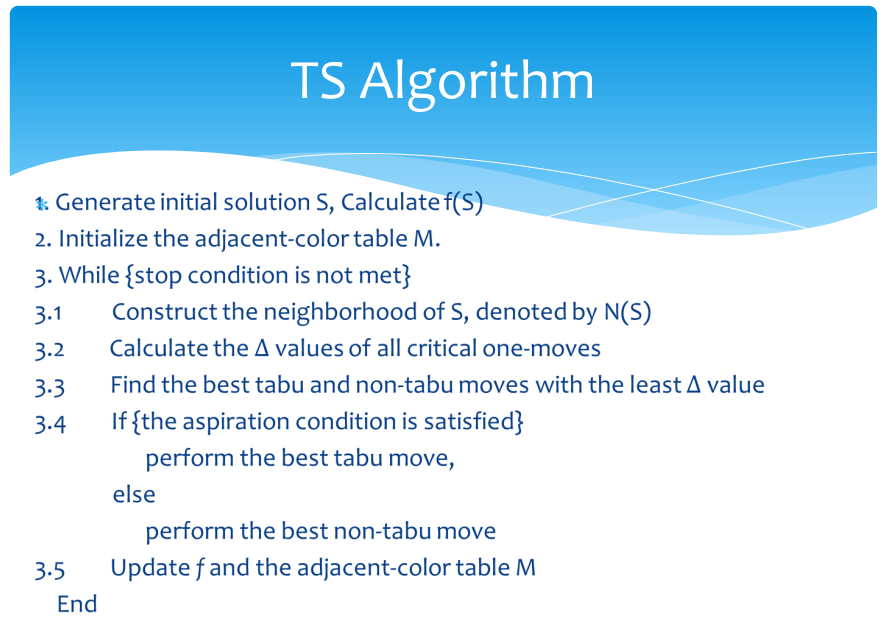
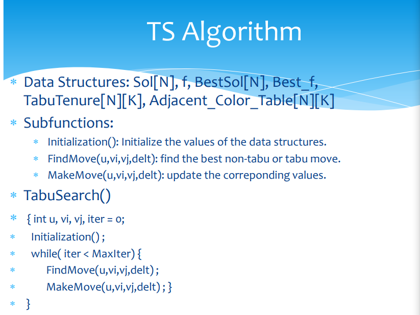

# 解决K-coloring问题——TS、HEA

## 引言

对于优化问题有以下分类:

禁忌搜索（TS）由局部搜索发展而来，局部搜索由爬山法发展而来。在了解禁忌搜索之前先熟悉这两种算法。

## 一、 什么是禁忌搜索算法（TS）

### **爬山算法**

爬山算法从当前的节点开始，和周围的邻居节点的值进行比较。 如果当前节点是最大的，那么返回当前节点，作为最大值 \(既山峰最高点\)；反之就用最高的邻居节点来，替换当前节点，从而实现向山峰的高处攀爬的目的。如此循环直到达到最高点。  
因为不是全面搜索，所以结果可能不是最佳。兔子可能只找到了泰山，就不再进行搜索了。

### **局部搜索算法**

局部搜索算法是从爬山法改进而来的。局部搜索算法的基本思想：在搜索过程中，始终选择当前点的邻居中与离目标最近者的方向搜索。同样，局部搜索得到的解不一定是最优解。

### **禁忌搜索算法**

为了找到“全局最优解”，就不应该执着于某一个特定的区域。于是人们对局部搜索进行了改进，得出了禁忌搜索算法。

禁忌（Tabu Search）算法是一种亚启发式\(meta-heuristic\)随机搜索算法，它从一个初始可行解出发，选择一系列的特定搜索方向（移动）作为试探，选择实现让特定的目标函数值变化最多的移动。为了避免陷入局部最优解，TS搜索中采用了一种灵活的“记忆”技术，对已经进行的优化过程进行记录和选择，指导下一步的搜索方向，这就是Tabu表的建立。

### **一群兔子**

1\) 爬山算法  
兔子朝着比现在高的地方跳去。他们找到了不远处的最高山峰。但是这座山不一定是珠穆朗玛峰。这就是爬山法，它不能保证局部最优值就是全局最优值。

2\) 禁忌搜索算法  
兔子们知道一个兔的力量是渺小的。他们互相转告着，哪里的山已经找过，并且找过的每一座山他们都留下一只兔子做记号。他们制定了下一步去哪里寻找的策略。这就是禁忌搜索。

## 二、禁忌搜索思想和过程

### 基本思想

标记已经解得的局部最优解或求解过程，并在进一步的迭代中避开这些局部最优解或求解过程。局部搜索的缺点在于，太过于对某一局部区域以及其邻域的搜索，导致一叶障目。为了找到全局最优解，禁忌搜索就是对于找到的一部分局部最优解，有意识地避开它，从而或得更多的搜索区域。当搜索足够大的周围区域后，再将这部分局部最优解进行比较，产生新的局部最优解也即需要规避的部分。

比喻：兔子们找到了泰山，它们之中的一只就会留守在这里，其他的再去别的地方寻找。就这样，一大圈后，把找到的几个山峰一比较，珠穆朗玛峰脱颖而出。

### 算法流程

总体思路描述

伪代码描述：

所要处理的是图着色问题，在步骤2中需要建立邻接表、邻接色矩阵，邻接节点数数组等内容。怎么判断当前状态的优劣呢？需要定义一个判断标准，在图着色问题中，将此标准定义为冲突节点对的总个数。

那么计算最优delt值，也就是计算当前状态的所有邻居状态，在图着色问题中即所有变色方案中，能够带来的最大冲突节点减少量。

## 还是一群兔子

为了找出地球上最高的山，一群有志气的兔子们开始想办法。 

（1）兔子朝着比现在高的地方跳去。他们找到了不远处的最高山峰。但是这座山不一定是珠穆朗玛峰。这就是爬山法，它不能保证局部最优值就是全局最优值。 

（2）兔子喝醉了。他随机地跳了很长时间。这期间，它可能走向高处，也可能踏入平地。但是，他渐渐清醒了并朝他踏过的最高方向跳去。这就是模拟退火。

 （3）兔子们知道一个兔的力量是渺小的。他们互相转告着，哪里的山已经找过，并且找过的每一座山他们都留下一只兔子做记号。他们制定了下一步去哪里寻找的策略。这就是禁忌搜索。 

（4）兔子们吃了失忆药片，并被发射到太空，然后随机落到了地球上的某些地方。他们不知道自己的使命是什么。但是，如果你过几年就杀死一部分海拔低的兔子，多产的兔子们自己就会找到珠穆朗玛峰。这就是遗传算法。

## 参考

华中科技大学SmartLab实验室 吕志鹏教授PPT 



[https://blog.csdn.net/tyhj\_sf/article/details/54235550](https://blog.csdn.net/tyhj_sf/article/details/54235550)

[https://www.jianshu.com/p/00aba9b8c017](https://www.jianshu.com/p/00aba9b8c017)

[https://www.cnblogs.com/dengfaheng/p/9737556.html](https://www.cnblogs.com/dengfaheng/p/9737556.html)

